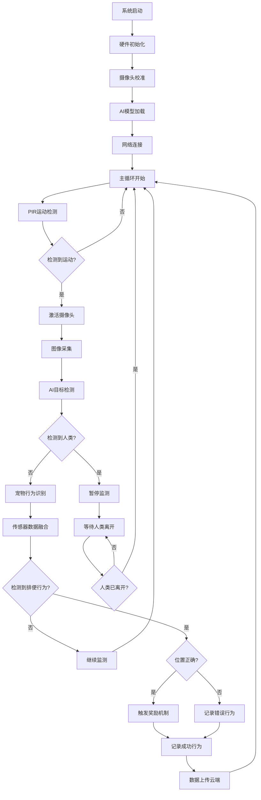

# 软件架构文档

## 系统架构概览

Poopal软件系统采用分层架构设计，包含设备端、云端和移动端三个主要部分：

```
┌─────────────────┐    ┌─────────────────┐    ┌─────────────────┐
│   移动端App     │    │     云端服务    │    │    设备端固件    │
│   (iOS/Android) │◄──►│   (AWS/阿里云)  │◄──►│   (ESP32-S3)    │
└─────────────────┘    └─────────────────┘    └─────────────────┘
```

## 设备端固件架构

### 核心模块

#### 1. 系统内核层
- **RTOS内核**：基于FreeRTOS实时操作系统
- **任务调度**：多任务并发处理，优先级管理
- **内存管理**：动态内存分配，内存泄漏检测
- **中断处理**：硬件中断响应和处理

#### 2. 硬件抽象层 (HAL)
```c
// 摄像头抽象接口
typedef struct {
    bool (*init)(camera_config_t* config);
    int (*capture_frame)(camera_frame_t* frame);
    bool (*set_quality)(int quality);
    void (*enable_night_vision)(bool enable);
} camera_interface_t;

// 传感器抽象接口
typedef struct {
    bool (*init)(void);
    int (*read)(sensor_data_t* data);
    bool (*calibrate)(void);
    void (*sleep)(void);
} sensor_interface_t;

// 执行器抽象接口  
typedef struct {
    bool (*init)(void);
    bool (*execute)(action_params_t* params);
    int (*get_status)(void);
} actuator_interface_t;
```

#### 3. 计算机视觉引擎

##### AI视觉处理核心
```c
// 视觉AI引擎接口
typedef struct {
    bool (*init)(void);
    detection_result_t (*detect_objects)(camera_frame_t* frame);
    behavior_result_t (*analyze_behavior)(detection_sequence_t* sequence);
    bool (*update_model)(const uint8_t* model_data, size_t size);
    void (*configure_roi)(region_of_interest_t* roi);
} vision_ai_engine_t;

// 检测结果结构
typedef struct {
    uint32_t timestamp;
    uint8_t object_count;
    detection_box_t objects[MAX_DETECTIONS];
    float confidence[MAX_DETECTIONS];
    object_type_t types[MAX_DETECTIONS];
} detection_result_t;

// 行为分析结果
typedef struct {
    behavior_type_t behavior;    // 行为类型
    float confidence;           // 置信度
    position_t location;        // 位置坐标
    uint32_t duration;         // 持续时间
    bool is_in_target_area;    // 是否在目标区域
} behavior_result_t;
```

##### 目标检测算法
- **YOLOv8轻量化模型**：专门优化的宠物检测模型
- **实时推理**：检测延迟<50ms，30fps视频流处理
- **多类别识别**：狗、猫、人等多种目标识别
- **边界框回归**：精确定位目标位置和大小

##### 行为识别算法
```python
# 行为识别神经网络结构
class BehaviorRecognitionModel:
    def __init__(self):
        self.temporal_cnn = TemporalCNN(input_frames=16)
        self.lstm_layer = LSTM(hidden_size=128)
        self.classifier = Linear(128, num_behaviors)
    
    def forward(self, frame_sequence):
        # 时序特征提取
        features = self.temporal_cnn(frame_sequence)
        # LSTM建模时序关系
        lstm_out, _ = self.lstm_layer(features)
        # 行为分类
        behavior_pred = self.classifier(lstm_out[-1])
        return behavior_pred
```

##### 智能过滤系统
```c
// 智能过滤器配置
typedef struct {
    bool enable_human_filter;      // 启用人体过滤
    bool enable_size_filter;       // 启用尺寸过滤
    float min_confidence;          // 最小置信度阈值
    uint32_t min_duration_ms;      // 最小持续时间
    region_of_interest_t roi;      // 感兴趣区域
} smart_filter_config_t;

// 人体检测过滤
bool filter_human_presence(detection_result_t* result) {
    for (int i = 0; i < result->object_count; i++) {
        if (result->types[i] == OBJECT_TYPE_HUMAN && 
            result->confidence[i] > HUMAN_DETECTION_THRESHOLD) {
            // 检测到人类，暂停宠物行为监测
            return true;
        }
    }
    return false;
}

// 区域过滤器
bool is_in_target_region(detection_box_t* box, region_of_interest_t* roi) {
    float center_x = (box->x1 + box->x2) / 2.0f;
    float center_y = (box->y1 + box->y2) / 2.0f;
    
    return (center_x >= roi->x_min && center_x <= roi->x_max &&
            center_y >= roi->y_min && center_y <= roi->y_max);
}
```

#### 4. 传感器融合模块
```c
// 多传感器数据融合
typedef struct {
    camera_frame_t vision_data;
    weight_data_t weight_data;
    pir_data_t motion_data;
    uint32_t timestamp;
} sensor_fusion_data_t;

// 卡尔曼滤波器用于位置融合
typedef struct {
    float state[4];        // [x, y, vx, vy]
    float covariance[4][4]; // 协方差矩阵
    float process_noise;    // 过程噪声
    float measurement_noise; // 测量噪声
} kalman_filter_t;

// 传感器融合算法
fusion_result_t sensor_fusion_process(sensor_fusion_data_t* data) {
    fusion_result_t result = {0};
    
    // 视觉检测结果
    detection_result_t vision_result = vision_detect(data->vision_data);
    
    // PIR运动检测结果
    bool motion_detected = pir_check_motion(data->motion_data);
    
    // 重量变化检测
    float weight_change = weight_analyze(data->weight_data);
    
    // 多传感器融合决策
    if (vision_result.object_count > 0 && motion_detected && weight_change > WEIGHT_THRESHOLD) {
        result.confidence = calculate_fusion_confidence(&vision_result, motion_detected, weight_change);
        result.behavior = analyze_behavior_fusion(&vision_result, weight_change);
        result.position = kalman_filter_update(&vision_result.objects[0]);
    }
    
    return result;
}
```

#### 5. 通信协议栈
- **WiFi管理**：连接管理、断线重连、网络配置
- **MQTT客户端**：消息发布订阅、QoS保证
- **蓝牙通信**：设备配对、近场通信
- **OTA更新**：固件和AI模型远程更新

### AI模型优化与部署

#### 1. 模型压缩技术
```c
// 量化配置
typedef struct {
    quantization_type_t type;  // INT8/INT16量化
    float scale_factor;        // 量化比例因子
    int zero_point;           // 零点偏移
} quantization_config_t;

// 模型剪枝配置
typedef struct {
    float sparsity_ratio;     // 稀疏度比例
    pruning_method_t method;  // 剪枝方法
    float sensitivity;        // 敏感度阈值
} pruning_config_t;
```

#### 2. 边缘计算优化
- **模型量化**：FP32→INT8量化，模型大小减少75%
- **网络剪枝**：去除冗余连接，推理速度提升60%
- **算子融合**：合并相邻算子，减少内存访问
- **内存优化**：动态内存分配，支持更大模型

#### 3. 实时性能优化
```c
// 性能监控结构
typedef struct {
    uint32_t frame_process_time_ms;
    uint32_t ai_inference_time_ms;
    uint32_t total_latency_ms;
    float cpu_usage_percent;
    size_t memory_usage_bytes;
} performance_metrics_t;

// 性能优化策略
void optimize_performance(performance_metrics_t* metrics) {
    if (metrics->ai_inference_time_ms > TARGET_INFERENCE_TIME) {
        // 降低模型精度或跳帧处理
        adjust_model_precision();
    }
    
    if (metrics->cpu_usage_percent > 80.0f) {
        // 动态调整帧率
        reduce_frame_rate();
    }
    
    if (metrics->memory_usage_bytes > MEMORY_THRESHOLD) {
        // 释放缓存，强制垃圾回收
        cleanup_memory_cache();
    }
}
```

### 软件流程图



## 云端服务架构

### 微服务架构

#### 1. AI模型管理服务
```python
class ModelManagementService:
    def __init__(self):
        self.model_registry = ModelRegistry()
        self.version_control = ModelVersionControl()
        
    async def train_model(self, training_data):
        """训练新的AI模型"""
        # 数据预处理
        processed_data = self.preprocess_data(training_data)
        
        # 模型训练
        model = await self.train_yolo_model(processed_data)
        
        # 模型验证
        metrics = self.validate_model(model, validation_data)
        
        # 模型注册
        model_id = self.model_registry.register(model, metrics)
        
        return model_id
    
    async def deploy_model(self, model_id, target_devices):
        """部署模型到设备"""
        model = self.model_registry.get_model(model_id)
        
        # 模型优化
        optimized_model = self.optimize_for_edge(model)
        
        # 分发到设备
        for device_id in target_devices:
            await self.push_model_to_device(device_id, optimized_model)
    
    def optimize_for_edge(self, model):
        """边缘设备模型优化"""
        # 量化压缩
        quantized_model = self.quantize_model(model, precision='int8')
        
        # 网络剪枝
        pruned_model = self.prune_model(quantized_model, sparsity=0.3)
        
        # 算子融合
        fused_model = self.fuse_operations(pruned_model)
        
        return fused_model
```

#### 2. 行为分析服务
```python
class BehaviorAnalysisService:
    def __init__(self):
        self.pattern_analyzer = PatternAnalyzer()
        self.progress_tracker = ProgressTracker()
    
    async def analyze_behavior_patterns(self, pet_id, time_range):
        """分析宠物行为模式"""
        # 获取行为数据
        behavior_data = await self.get_behavior_data(pet_id, time_range)
        
        # 时间序列分析
        patterns = self.pattern_analyzer.find_patterns(behavior_data)
        
        # 成功率趋势分析
        success_trend = self.analyze_success_trend(behavior_data)
        
        # 异常检测
        anomalies = self.detect_anomalies(behavior_data)
        
        return {
            'patterns': patterns,
            'success_trend': success_trend,
            'anomalies': anomalies,
            'recommendations': self.generate_recommendations(patterns)
        }
    
    def generate_recommendations(self, patterns):
        """基于行为模式生成训练建议"""
        recommendations = []
        
        if patterns['success_rate'] < 0.7:
            recommendations.append({
                'type': 'training_intensity',
                'message': '建议增加训练频率，提高成功率'
            })
        
        if patterns['peak_hours']:
            recommendations.append({
                'type': 'optimal_time',
                'message': f'最佳训练时间：{patterns["peak_hours"]}'
            })
        
        return recommendations
```

#### 3. 设备管理服务
```python
class DeviceManagementService:
    def __init__(self):
        self.device_registry = DeviceRegistry()
        self.telemetry_processor = TelemetryProcessor()
    
    async def process_device_telemetry(self, device_id, telemetry_data):
        """处理设备遥测数据"""
        # 数据验证
        validated_data = self.validate_telemetry(telemetry_data)
        
        # 设备状态更新
        await self.update_device_status(device_id, validated_data)
        
        # 异常检测
        anomalies = self.detect_device_anomalies(validated_data)
        
        if anomalies:
            await self.send_maintenance_alert(device_id, anomalies)
        
        # 性能优化建议
        optimization_tips = self.analyze_performance(validated_data)
        
        return {
            'status': 'processed',
            'anomalies': anomalies,
            'optimization_tips': optimization_tips
        }
```

### 数据库设计增强

#### AI训练数据表
```sql
-- AI训练数据集表
CREATE TABLE ai_training_datasets (
    id BIGINT PRIMARY KEY AUTO_INCREMENT,
    dataset_name VARCHAR(100) NOT NULL,
    version VARCHAR(20) NOT NULL,
    data_type ENUM('detection', 'behavior', 'fusion') NOT NULL,
    total_samples INT NOT NULL,
    created_at TIMESTAMP DEFAULT CURRENT_TIMESTAMP,
    metadata JSON
);

-- 模型版本管理表
CREATE TABLE ai_models (
    id BIGINT PRIMARY KEY AUTO_INCREMENT,
    model_name VARCHAR(100) NOT NULL,
    version VARCHAR(20) NOT NULL,
    model_type ENUM('detection', 'behavior', 'fusion') NOT NULL,
    accuracy FLOAT,
    model_size_mb FLOAT,
    inference_time_ms INT,
    created_at TIMESTAMP DEFAULT CURRENT_TIMESTAMP,
    model_data LONGBLOB
);

-- 设备模型部署记录
CREATE TABLE device_model_deployments (
    id BIGINT PRIMARY KEY AUTO_INCREMENT,
    device_id VARCHAR(100) NOT NULL,
    model_id BIGINT NOT NULL,
    deployment_status ENUM('pending', 'deployed', 'failed') DEFAULT 'pending',
    deployed_at TIMESTAMP NULL,
    performance_metrics JSON,
    FOREIGN KEY (model_id) REFERENCES ai_models(id)
);

-- 视觉检测原始数据表
CREATE TABLE vision_detections (
    id BIGINT PRIMARY KEY AUTO_INCREMENT,
    device_id VARCHAR(100) NOT NULL,
    timestamp TIMESTAMP DEFAULT CURRENT_TIMESTAMP,
    frame_id VARCHAR(50),
    detection_results JSON,  -- 检测结果：目标框、置信度等
    image_metadata JSON,     -- 图像元数据：分辨率、光照等
    processed BOOLEAN DEFAULT FALSE
);
```

## 移动端应用架构

### AI相关功能模块

#### 1. 实时监控模块
```javascript
// 实时视频流组件
const LiveMonitorComponent = () => {
  const [detectionResults, setDetectionResults] = useState([]);
  const [isAnalyzing, setIsAnalyzing] = useState(false);
  
  useEffect(() => {
    // WebSocket连接接收实时检测结果
    const ws = new WebSocket(`${WS_BASE_URL}/device/${deviceId}/live`);
    
    ws.onmessage = (event) => {
      const data = JSON.parse(event.data);
      if (data.type === 'detection_result') {
        setDetectionResults(data.detections);
        setIsAnalyzing(data.analyzing);
      }
    };
    
    return () => ws.close();
  }, [deviceId]);
  
  return (
    <View style={styles.container}>
      <VideoPlayer source={`${VIDEO_BASE_URL}/device/${deviceId}/stream`} />
      <DetectionOverlay detections={detectionResults} />
      <AnalysisIndicator isAnalyzing={isAnalyzing} />
    </View>
  );
};
```

#### 2. AI训练数据管理
```javascript
// AI训练数据收集
const TrainingDataManager = {
  async collectPositiveSample(deviceId, timestamp) {
    const sample = {
      device_id: deviceId,
      timestamp: timestamp,
      label: 'positive',
      user_confirmed: true
    };
    
    return await api.post('/training-data/samples', sample);
  },
  
  async collectNegativeSample(deviceId, timestamp) {
    const sample = {
      device_id: deviceId,
      timestamp: timestamp,
      label: 'negative',
      user_confirmed: true
    };
    
    return await api.post('/training-data/samples', sample);
  },
  
  async submitFeedback(detectionId, isCorrect, actualBehavior) {
    const feedback = {
      detection_id: detectionId,
      is_correct: isCorrect,
      actual_behavior: actualBehavior,
      timestamp: new Date().toISOString()
    };
    
    return await api.post('/ai/feedback', feedback);
  }
};
```

### 隐私保护功能

#### 1. 本地处理模式
```javascript
// 隐私设置管理
const PrivacySettingsSlice = createSlice({
  name: 'privacy',
  initialState: {
    localProcessingOnly: true,
    humanDetectionEnabled: true,
    privacyZones: [],
    workingHours: { start: '09:00', end: '18:00' },
    emergencyStop: false
  },
  reducers: {
    toggleLocalProcessing: (state, action) => {
      state.localProcessingOnly = action.payload;
    },
    setPrivacyZones: (state, action) => {
      state.privacyZones = action.payload;
    },
    enableEmergencyStop: (state) => {
      state.emergencyStop = true;
      // 立即停止所有监控功能
    }
  }
});
```

#### 2. 人体检测过滤
```javascript
// 人体检测状态管理
const HumanDetectionComponent = () => {
  const [humanPresent, setHumanPresent] = useState(false);
  const [monitoringPaused, setMonitoringPaused] = useState(false);
  
  useEffect(() => {
    const subscription = DeviceEventEmitter.addListener(
      'human_detection_update',
      (data) => {
        setHumanPresent(data.human_detected);
        setMonitoringPaused(data.monitoring_paused);
        
        if (data.human_detected) {
          // 显示隐私保护提示
          showPrivacyNotification();
        }
      }
    );
    
    return () => subscription.remove();
  }, []);
  
  return (
    <View style={styles.privacyIndicator}>
      {humanPresent && (
        <Text style={styles.privacyText}>
          🔒 检测到人员活动，监控已暂停以保护隐私
        </Text>
      )}
    </View>
  );
};
```

## 安全与隐私架构

### 数据安全
- **端到端加密**：所有敏感数据采用AES-256加密
- **本地AI处理**：视觉数据仅在设备本地处理，不上传云端
- **数据脱敏**：上传统计数据时去除个人标识信息
- **访问控制**：基于角色的访问控制(RBAC)

### 隐私保护技术
```c
// 隐私保护算法
typedef struct {
    bool enable_human_filter;
    region_t privacy_zones[MAX_PRIVACY_ZONES];
    time_range_t active_hours;
    bool emergency_stop;
} privacy_config_t;

// 人体检测隐私保护
bool privacy_check_human_presence(detection_result_t* result) {
    for (int i = 0; i < result->object_count; i++) {
        if (result->types[i] == OBJECT_TYPE_HUMAN) {
            // 检测到人类，触发隐私保护
            privacy_pause_monitoring();
            return true;
        }
    }
    return false;
}

// 隐私区域检查
bool is_in_privacy_zone(detection_box_t* box, privacy_config_t* config) {
    for (int i = 0; i < config->num_privacy_zones; i++) {
        if (box_intersects_region(box, &config->privacy_zones[i])) {
            return true;
        }
    }
    return false;
}
```

## 性能监控与优化

### 实时性能监控
```c
// 性能指标收集
typedef struct {
    // AI推理性能
    uint32_t detection_latency_ms;
    uint32_t behavior_analysis_latency_ms;
    float detection_accuracy;
    
    // 系统资源使用
    float cpu_usage_percent;
    size_t memory_usage_bytes;
    float gpu_usage_percent;
    
    // 网络性能
    uint32_t network_latency_ms;
    uint32_t data_upload_rate_kbps;
    
    // 设备状态
    uint8_t battery_level;
    float device_temperature_c;
} performance_metrics_t;

// 性能优化决策
void adaptive_performance_control(performance_metrics_t* metrics) {
    // 基于性能指标动态调整
    if (metrics->detection_latency_ms > 100) {
        // 降低检测频率或模型精度
        adjust_detection_frequency(0.8f);
    }
    
    if (metrics->cpu_usage_percent > 90.0f) {
        // 启用省电模式
        enable_power_saving_mode();
    }
    
    if (metrics->device_temperature_c > 60.0f) {
        // 降低处理负载，防止过热
        reduce_processing_load();
    }
}
```

### 自适应算法优化
- **动态模型切换**：根据场景自动选择最优模型
- **自适应帧率调整**：根据活动量调整处理帧率
- **智能缓存策略**：预测性缓存常用模型和数据
- **负载均衡**：在多核处理器间智能分配计算任务

## 开发与测试

### AI模型测试框架
```python
class ModelTestFramework:
    def __init__(self):
        self.test_datasets = TestDatasetManager()
        self.metrics_calculator = MetricsCalculator()
    
    def test_detection_model(self, model, test_dataset):
        """测试目标检测模型"""
        results = []
        
        for sample in test_dataset:
            prediction = model.detect(sample.image)
            ground_truth = sample.annotations
            
            # 计算检测指标
            metrics = self.calculate_detection_metrics(prediction, ground_truth)
            results.append(metrics)
        
        return self.aggregate_results(results)
    
    def test_behavior_model(self, model, test_sequences):
        """测试行为识别模型"""
        results = []
        
        for sequence in test_sequences:
            prediction = model.analyze_behavior(sequence.frames)
            ground_truth = sequence.behavior_label
            
            # 计算分类指标
            metrics = self.calculate_classification_metrics(prediction, ground_truth)
            results.append(metrics)
        
        return self.aggregate_results(results)
```

### 集成测试策略
- **硬件在环测试(HIL)**：真实硬件环境测试
- **视觉算法测试**：大规模数据集验证
- **性能压力测试**：极限场景下的系统稳定性
- **用户体验测试**：真实用户环境测试

这个更新后的软件架构充分体现了基于摄像头的AI视觉系统，去除了热成像相关内容，并强化了隐私保护和人体检测过滤功能。
