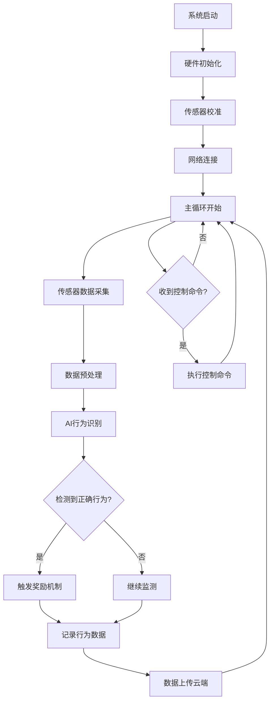

# 软件架构文档

## 系统架构概览

Poopal软件系统采用分层架构设计，包含设备端、云端和移动端三个主要部分：

```
┌─────────────────┐    ┌─────────────────┐    ┌─────────────────┐
│   移动端App     │    │     云端服务    │    │    设备端固件    │
│   (iOS/Android) │◄──►│   (AWS/阿里云)  │◄──►│   (ESP32-S3)    │
└─────────────────┘    └─────────────────┘    └─────────────────┘
```

## 设备端固件架构

### 核心模块

#### 1. 系统内核层
- **RTOS内核**：基于FreeRTOS实时操作系统
- **任务调度**：多任务并发处理，优先级管理
- **内存管理**：动态内存分配，内存泄漏检测
- **中断处理**：硬件中断响应和处理

#### 2. 硬件抽象层 (HAL)
```c
// 传感器抽象接口
typedef struct {
    bool (*init)(void);
    int (*read)(sensor_data_t* data);
    bool (*calibrate)(void);
    void (*sleep)(void);
} sensor_interface_t;

// 执行器抽象接口  
typedef struct {
    bool (*init)(void);
    bool (*execute)(action_params_t* params);
    int (*get_status)(void);
} actuator_interface_t;
```

#### 3. 传感器管理模块
- **数据采集**：多传感器数据实时采集
- **数据融合**：卡尔曼滤波算法，提高检测精度
- **异常检测**：传感器故障自诊断
- **校准管理**：自动校准和手动校准接口

#### 4. AI推理引擎
- **模型格式**：TensorFlow Lite for Microcontrollers
- **推理优化**：量化模型，降低计算复杂度
- **在线学习**：增量学习算法，适应个体差异
- **边缘计算**：本地实时决策，减少延迟

```c
// AI推理接口
typedef struct {
    bool (*load_model)(const char* model_path);
    float (*predict)(sensor_data_t* input);
    bool (*update_model)(training_data_t* data);
} ai_engine_t;
```

#### 5. 通信协议栈
- **WiFi管理**：连接管理、断线重连、网络配置
- **MQTT客户端**：消息发布订阅、QoS保证
- **蓝牙通信**：设备配对、近场通信
- **OTA更新**：固件远程更新，版本管理

### 软件流程图



## 云端服务架构

### 微服务架构

#### 1. 用户管理服务
- **用户认证**：JWT令牌，OAuth2.0集成
- **权限管理**：RBAC角色权限控制
- **账户信息**：用户档案、宠物信息管理

#### 2. 设备管理服务
- **设备注册**：设备绑定、激活管理
- **状态监控**：实时状态、健康检查
- **远程控制**：命令下发、响应处理

#### 3. 数据分析服务
```python
# 行为分析算法示例
class BehaviorAnalyzer:
    def __init__(self):
        self.model = load_trained_model()
    
    def analyze_behavior(self, sensor_data):
        """分析宠物行为模式"""
        features = self.extract_features(sensor_data)
        prediction = self.model.predict(features)
        return {
            'behavior_type': prediction.label,
            'confidence': prediction.probability,
            'timestamp': sensor_data.timestamp
        }
    
    def generate_insights(self, historical_data):
        """生成行为洞察报告"""
        patterns = self.find_patterns(historical_data)
        recommendations = self.generate_recommendations(patterns)
        return {
            'patterns': patterns,
            'recommendations': recommendations,
            'training_progress': self.calculate_progress(historical_data)
        }
```

#### 4. 通知服务
- **实时推送**：WebSocket长连接，消息推送
- **邮件通知**：SMTP服务，邮件模板管理
- **短信通知**：SMS网关集成，紧急通知

#### 5. AI训练服务
- **模型训练**：分布式训练，GPU集群
- **模型优化**：超参数调优，模型压缩
- **模型部署**：版本管理，灰度发布

### 数据库设计

#### 主要数据表结构

```sql
-- 用户表
CREATE TABLE users (
    id BIGINT PRIMARY KEY AUTO_INCREMENT,
    username VARCHAR(50) UNIQUE NOT NULL,
    email VARCHAR(100) UNIQUE NOT NULL,
    password_hash VARCHAR(255) NOT NULL,
    created_at TIMESTAMP DEFAULT CURRENT_TIMESTAMP
);

-- 宠物信息表
CREATE TABLE pets (
    id BIGINT PRIMARY KEY AUTO_INCREMENT,
    user_id BIGINT NOT NULL,
    name VARCHAR(50) NOT NULL,
    breed VARCHAR(50),
    age INT,
    weight FLOAT,
    created_at TIMESTAMP DEFAULT CURRENT_TIMESTAMP,
    FOREIGN KEY (user_id) REFERENCES users(id)
);

-- 设备表
CREATE TABLE devices (
    id BIGINT PRIMARY KEY AUTO_INCREMENT,
    device_id VARCHAR(100) UNIQUE NOT NULL,
    user_id BIGINT NOT NULL,
    pet_id BIGINT,
    status ENUM('online', 'offline', 'maintenance'),
    firmware_version VARCHAR(20),
    last_seen TIMESTAMP,
    FOREIGN KEY (user_id) REFERENCES users(id),
    FOREIGN KEY (pet_id) REFERENCES pets(id)
);

-- 行为记录表
CREATE TABLE behavior_records (
    id BIGINT PRIMARY KEY AUTO_INCREMENT,
    device_id VARCHAR(100) NOT NULL,
    pet_id BIGINT NOT NULL,
    behavior_type ENUM('correct', 'incorrect', 'unknown'),
    confidence FLOAT,
    sensor_data JSON,
    timestamp TIMESTAMP DEFAULT CURRENT_TIMESTAMP,
    FOREIGN KEY (pet_id) REFERENCES pets(id)
);
```

## 移动端应用架构

### 技术栈
- **跨平台框架**：React Native
- **状态管理**：Redux + Redux Toolkit
- **网络请求**：Axios + Interceptors
- **本地存储**：AsyncStorage + SQLite
- **实时通信**：WebSocket + Socket.io

### 应用模块

#### 1. 认证模块
```javascript
// 用户认证状态管理
const authSlice = createSlice({
  name: 'auth',
  initialState: {
    user: null,
    token: null,
    isAuthenticated: false,
    loading: false
  },
  reducers: {
    loginStart: (state) => {
      state.loading = true;
    },
    loginSuccess: (state, action) => {
      state.user = action.payload.user;
      state.token = action.payload.token;
      state.isAuthenticated = true;
      state.loading = false;
    },
    logout: (state) => {
      state.user = null;
      state.token = null;
      state.isAuthenticated = false;
    }
  }
});
```

#### 2. 设备控制模块
- **设备发现**：蓝牙扫描、WiFi配网
- **实时监控**：设备状态、传感器数据展示
- **远程控制**：参数设置、手动控制
- **固件更新**：OTA更新进度显示

#### 3. 数据可视化模块
- **图表库**：Victory Native图表组件
- **实时数据**：WebSocket数据流
- **历史数据**：分页加载、筛选查询
- **报告生成**：PDF导出、分享功能

#### 4. 训练管理模块
- **训练计划**：个性化训练方案
- **进度跟踪**：训练效果评估
- **行为分析**：行为模式识别
- **奖励设置**：奖励策略配置

### API接口设计

#### RESTful API规范

```javascript
// 设备相关API
GET    /api/v1/devices          // 获取设备列表
POST   /api/v1/devices          // 添加新设备
GET    /api/v1/devices/:id      // 获取设备详情
PUT    /api/v1/devices/:id      // 更新设备信息
DELETE /api/v1/devices/:id      // 删除设备

// 行为数据API
GET    /api/v1/behaviors                    // 获取行为记录
POST   /api/v1/behaviors                    // 上传行为数据
GET    /api/v1/behaviors/statistics         // 获取统计数据
GET    /api/v1/behaviors/analysis/:pet_id   // 获取行为分析

// 实时通信WebSocket
ws://api.example.com/ws/device/:device_id   // 设备实时数据
ws://api.example.com/ws/notifications       // 推送通知
```

## 安全架构

### 数据安全
- **传输加密**：TLS 1.3端到端加密
- **存储加密**：AES-256数据库加密
- **访问控制**：API网关、限流控制
- **审计日志**：操作记录、安全事件追踪

### 设备安全
- **设备认证**：PKI证书认证
- **固件签名**：代码签名验证
- **安全启动**：Secure Boot验证
- **密钥管理**：硬件安全模块(HSM)

### 隐私保护
- **数据匿名化**：个人信息脱敏
- **权限最小化**：最小权限原则
- **合规性**：GDPR、CCPA合规
- **用户控制**：数据删除、导出权利

## 部署架构

### 容器化部署
```yaml
# docker-compose.yml
version: '3.8'
services:
  api-gateway:
    image: poopal/api-gateway:latest
    ports:
      - "80:80"
      - "443:443"
    environment:
      - RATE_LIMIT=1000
      - SSL_CERT_PATH=/certs
  
  user-service:
    image: poopal/user-service:latest
    environment:
      - DB_HOST=mysql
      - REDIS_HOST=redis
    depends_on:
      - mysql
      - redis
  
  mysql:
    image: mysql:8.0
    environment:
      - MYSQL_ROOT_PASSWORD=secure_password
      - MYSQL_DATABASE=poopal
    volumes:
      - mysql_data:/var/lib/mysql
  
  redis:
    image: redis:7-alpine
    volumes:
      - redis_data:/data
```

### 监控和运维
- **日志管理**：ELK Stack (Elasticsearch, Logstash, Kibana)
- **性能监控**：Prometheus + Grafana
- **错误追踪**：Sentry错误监控
- **健康检查**：Kubernetes健康探针

## 开发规范

### 代码规范
- **C/C++**：Google C++ Style Guide
- **Python**：PEP 8编码规范
- **JavaScript**：ESLint + Prettier
- **文档**：Doxygen自动化文档

### 测试策略
- **单元测试**：覆盖率>90%
- **集成测试**：API接口测试
- **硬件测试**：HIL(Hardware-in-the-Loop)
- **性能测试**：负载测试、压力测试

### CI/CD流程
1. **代码提交** → Git Hook检查
2. **自动构建** → Docker镜像构建
3. **自动测试** → 单元测试、集成测试
4. **质量检查** → SonarQube代码质量分析
5. **部署** → 自动部署到测试环境
6. **发布** → 手动确认后生产环境部署
